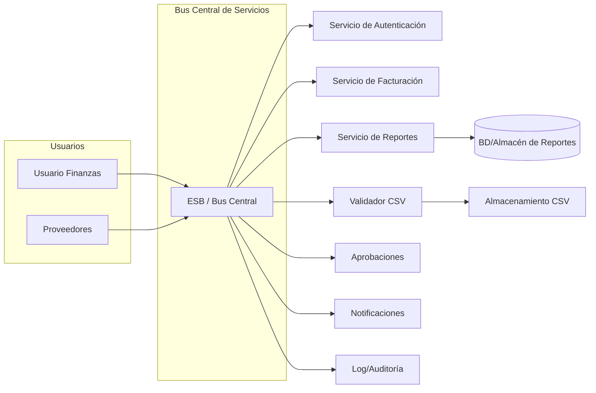
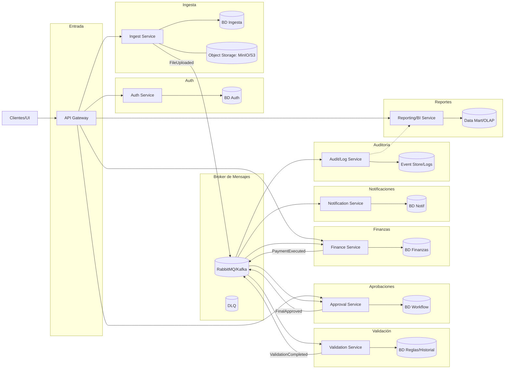

# Práctica 3 --- Arquitectura de Microservicios

**Curso:** Software Avanzado\
**Tema:** Análisis de arquitectura y migración a microservicios\
**Autor:** Esdras Jonatan Noj Larios

------------------------------------------------------------------------

## 1) Diagnóstico de la arquitectura actual

### 1.1 Características observables

-   Carga de **CSV** (facturas/gastos/ingresos); validación previa a
    procesamiento.
-   **Flujo de aprobación** en 3 niveles (asistente → supervisor →
    director financiero).
-   **Notificaciones por correo** al finalizar.
-   **Auditoría/logs** y **historial** de archivos/transacciones.
-   Dependencia fuerte de un **bus central/orquestador** en picos
    (cierre de mes).

### 1.2 Conclusión

-   Patrón tipo **SOA con ESB** / *monolito distribuido* alrededor de un
    **bus central**.
-   **Riesgos**: acoplamiento, cuello de botella, *back-pressure*, baja
    elasticidad.

### 1.3 Diagrama --- Arquitectura actual

### Diagrama de Arquitectura Actual

------------------------------------------------------------------------

## 2) Cuellos de botella

-   **ESB/Bus central** concentra orquestación y tráfico.
-   **Procesamiento batch** de CSV como operación síncrona prolongada.
-   **Dependencias** entre módulos → escalar uno afecta a otros.
-   **Logs** sin segmentación/retención afectan búsquedas.

------------------------------------------------------------------------

## 3) Arquitectura objetivo (Microservicios)

### 3.1 Principios

-   **Dominios bien definidos** por servicio (alta cohesión).\
-   **BD por servicio** (evitar BD compartida).\
-   **API Gateway** para entrada, auth y rate limiting.\
-   **Mensajería** para procesos largos (event-driven), **REST** para
    consultas/acciones.\
-   **Observabilidad**: trazas (OpenTelemetry), métricas (Prometheus),
    logs estructurados.

### 3.2 Diagrama --- Arquitectura propuesta

### 3.3 Razones del diseño

-   **Escalabilidad**: ING/VAL/APR escalan sin impactar Auth/Notif.
-   **Resiliencia**: reintentos + **DLQ**; **idempotencia** por
    `requestId`.
-   **Evolución**: despliegue independiente; **versionado** de
    contratos.

### Diagrama de Arquitectura Propuesta

------------------------------------------------------------------------

## 4) Modelos de datos (BD por servicio)

## 5) Flujos clave (secuencias)

### 5.1 Carga y validación de CSV

### 5.2 Aprobación en 3 niveles

### 5.3 Notificación y auditoría

------------------------------------------------------------------------
